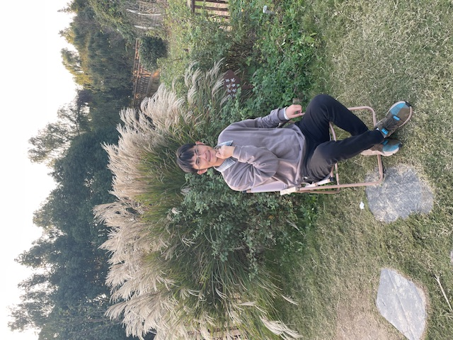

Hello, I'm glad you're visiting my blog! I'm Zhang Jian, from Suzhou, China.

I'm currently a freelancer doing online web development work, quoting $30/hour.

In my spare time, I contribute code to the open source project [Markdown Resume Blog](https://github.com/PersonalBranding/personal-brand-website-builder).

This is my own project and the blog engine for the website you're currently visiting.

In addition, I also created the website [LeetCode.blog](https://leetcode.blog) to teach programming algorithms.

Of course, what you care about most is: **I used to be addicted to video games, but later I quit completely**. If you want to know how I quit games, please follow this site!

If you need my service, please contact me!
